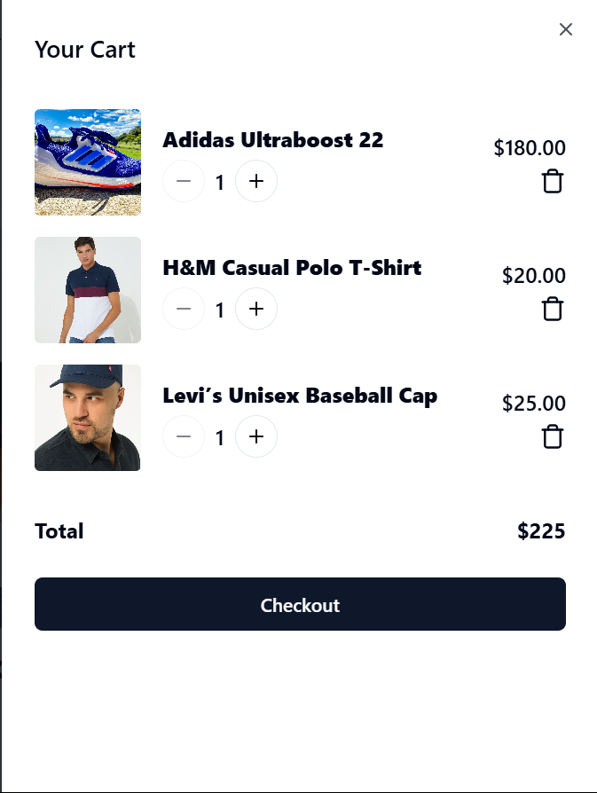
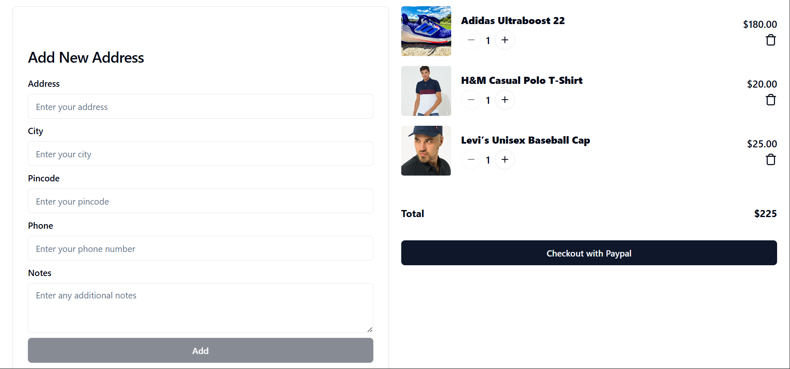

# E-Commerce Website

This is a fully functional E-commerce platform built using the MERN stack (MongoDB, Express.js, React.js, Node.js) with state management handled by Redux and authentication implemented using JWT (JSON Web Tokens). It supports role-based access control for different user types such as admin and customer.

## Features
- **Frontend:** Built using React.js and React Router for seamless navigation.
- **State Management:** Utilized Redux for maintaining consistent state across the application, including Shopping Cart and User Login functionality.
- **Authentication:** Implemented JWT (JSON Web Tokens) for secure and efficient user sessions.
- **Role-Based Access Control:** Managed permissions for different user roles (admin, customer) to ensure secure and restricted access.
- **Backend:** Built using Express.js and Node.js with MongoDB as the database.

## Tech Stack
- **Frontend:** React.js, React Router, Redux
- **Backend:** Node.js, Express.js
- **Database:** MongoDB
- **Authentication:** JWT (JSON Web Tokens)
- **State Management:** Redux

## Preview
#### Sign In
<p align="left">
  
</p>

#### All Products
<p align="left">
  
</p>

#### Add to Cart
<p align="left">
  
</p>

#### checkout
<p align="left">
  
</p>

#### Address
<p align="left">
  
</p>

## Installation

1. Clone the repository:
```bash
   git clone https://github.com/anil-52026/MERN-E-Commerce-Website.git
```

2. Install dependencies for the client:
```bash
   cd client
   npm install
```

3. Install dependencies for the server:
```bash
   cd server
   npm install
```

4. Create a `.env` file in the server directory and add your environment variables:
```
MONGO_URI=your_mongodb_connection_string
JWT_SECRET=your_jwt_secret
```

5. Run the application:
```bash
   npm run dev
```

## Usage
- Admin users can add, update, or delete products.
- Customers can browse products, add them to the cart, and proceed with the checkout process.
- User authentication is handled using JWT for secure login sessions.

## Folder Structure
```
├── client       # Frontend (ReactJS)
├── server       # Backend (NodeJS, ExpressJS)
├── README.md    # Documentation
```


